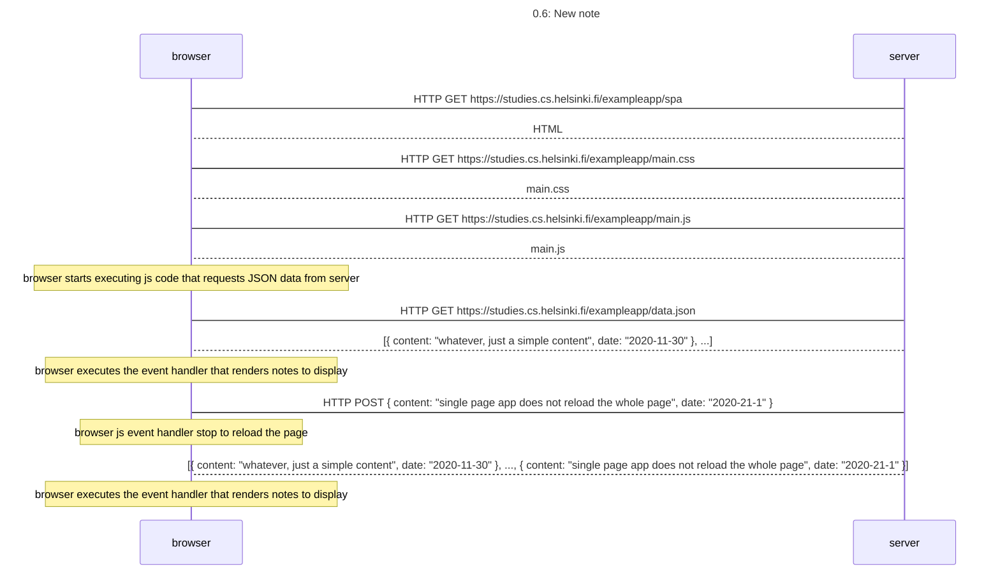
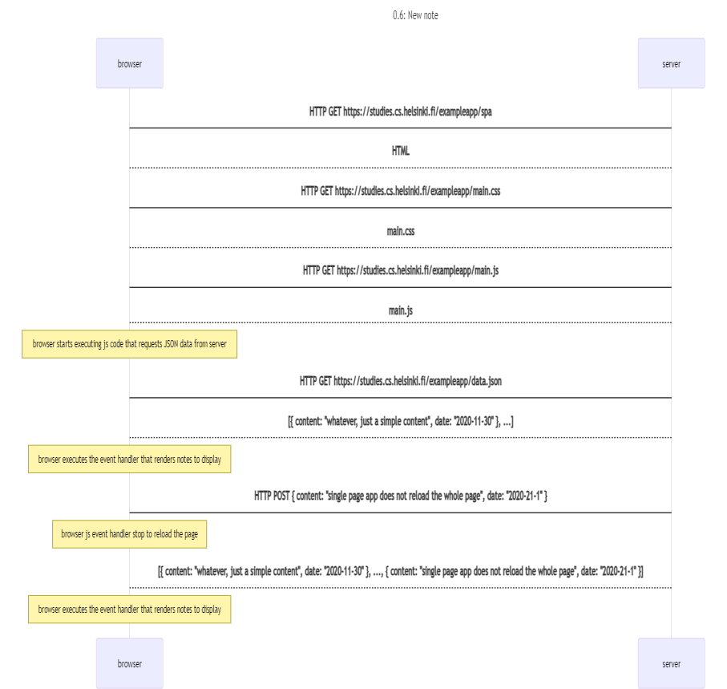

# 0.6: New note

```mermaid
sequenceDiagram
    Title: 0.6: New note

    browser->server: HTTP GET https://studies.cs.helsinki.fi/exampleapp/spa
    server-->browser: HTML
    browser->server: HTTP GET https://studies.cs.helsinki.fi/exampleapp/main.css
    server-->browser: main.css
    browser->server: HTTP GET https://studies.cs.helsinki.fi/exampleapp/main.js
    server-->browser: main.js

    note over browser: browser starts executing js code that requests JSON data from server

    browser->server: HTTP GET https://studies.cs.helsinki.fi/exampleapp/data.json
    server-->browser: [{ content: "whatever, just a simple content", date: "2020-11-30" }, ...]

    note over browser: browser executes the event handler that renders notes to display

    browser->server: HTTP POST { content: "single page app does not reload the whole page", date: "2020-21-1" }

    note over browser: browser js event handler stop to reload the page

    server-->browser: [{ content: "whatever, just a simple content", date: "2020-11-30" }, ..., { content: "single page app does not reload the whole page", date: "2020-21-1" }]

    note over browser: browser executes the event handler that renders notes to display
```

